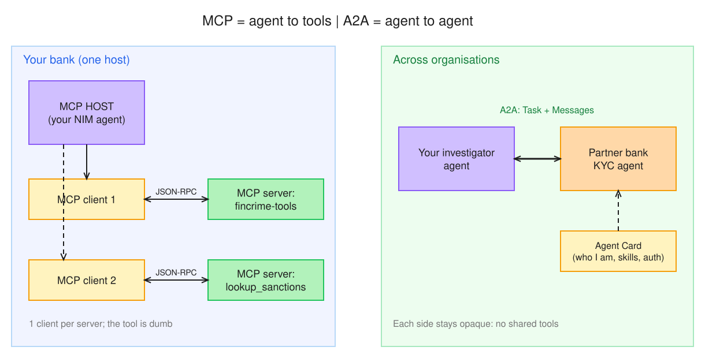

# Week 2 Day 2: MCP server, MCP bridge, A2A agent card

## §1 Bets

- **Bet A** (does the NIM agent pick the GH-600 sanctions tool first try, from the tool list alone?): guess **Yes**
- **Bet B** (partner bank's KYC agent asks your investigator about a shared customer: which protocol?): guess **A2A** (first said MCP, changed after seeing the MCP-vs-A2A diagram)

## §2 MCP vs A2A

- **MCP**: agent to tools/data. A host creates one client per server; the client calls the server's tools, resources and prompts over JSON-RPC (stdio or Streamable HTTP).
- **A2A**: agents collaborating across boundaries. A peer is discovered via its Agent Card, then work is a stateful Task made of Messages, Parts and Artifacts.
- **In my Google ADK platform, MCP fits** as the agents' tools: an ADK agent connects to MCP servers (sanctions lookup, registry) as its tool source.
- **In my Google ADK platform, A2A fits** between agents or teams: agents owned by other teams or systems, each opaque, exposed with an Agent Card.



*Editable source: [w02d02-m1-mcp-vs-a2a.excalidraw](../../docs/diagrams/w02d02-m1-mcp-vs-a2a.excalidraw)*

## §3 Bridge runs

Same `mcp_bridge.py`, two servers:

```
# my server (Day 4 tools over MCP)
MCP tools: ['get_alert', 'search_policy', 'flag_alert']
[1] MCP get_alert({"alert_id":"A-1002"}) -> {"customer": "Blue Harbor Imports", ...}
[2] MCP search_policy({"query":"wires to high-risk jurisdiction enhanced due diligence"}) -> [{"id": "POL-03", ...}]

# GH-600 server (written for Copilot)
MCP tools: ['lookup_sanctions']
[1] MCP lookup_sanctions({"name":"Orbit Trading Ltd"}) -> {"error": "SANCTIONS_API_KEY not set"}
```

- **Changed in the bridge: nothing.** Only the command after `--` differs. The GH-600 server has no `mcp.run()`, so it must be launched as `uv run mcp run <file>` (the Copilot config's launch), not `python <file>`: `python` exited at once and the bridge saw `Connection closed`.
- **The key never arrived:** a stdio server gets only a default environment plus an explicit `env`, so my shell's `SANCTIONS_API_KEY` stayed behind (same lesson as GH-600 Day 9).
- **The agent did not turn the error into "not sanctioned":** it said it could not confirm. A failed screening must never read as a clean one.

## §4 Agent card notes

Card: [sanctions-agent-card.json](../../docs/a2a/sanctions-agent-card.json) (synthetic sanctions-screening agent owned by another team).

- **Spec check:** the guide listed `id` as a required AgentCard field and `security` as the auth field. The normative [`a2a.proto`](https://github.com/a2aproject/A2A/blob/main/specification/a2a.proto) (1.0) has **no `id` on AgentCard**; it requires `name`, `description`, `supportedInterfaces`, `version`, `capabilities`, `defaultInputModes`, `defaultOutputModes`, `skills`. The skill requires `id`, `name`, `description`, `tags`. The auth fields are `securitySchemes` + `securityRequirements`.
- **Security:** OAuth2 client credentials, one client per calling agent, scope `screening:run`. A cross-bank agent must authenticate and be scoped.
- **Skill = capability, not internals:** `screen-counterparty` says what it does; the other team never sees my MCP server or its tools (MCP stays inside, A2A is the outside contract).
- **One task exchange** (alert-triage agent -> screening agent):
  1. Triage sends a Message: "Screen J. Smith" -> task is `SUBMITTED`, then `WORKING`.
  2. Two different J. Smiths match -> task moves to `INPUT_REQUIRED` (asks for date of birth) instead of guessing.
  3. Triage replies with a Message containing the date of birth -> `WORKING` again.
  4. Task ends `COMPLETED` with an **Artifact** (a `data` Part: `{match: false, lists_checked: [...]}`).
