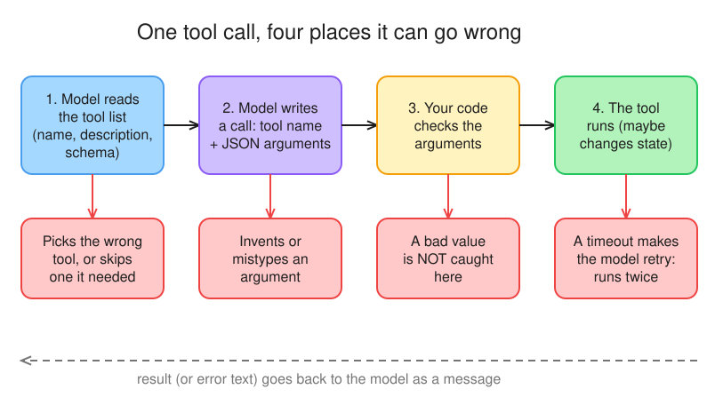
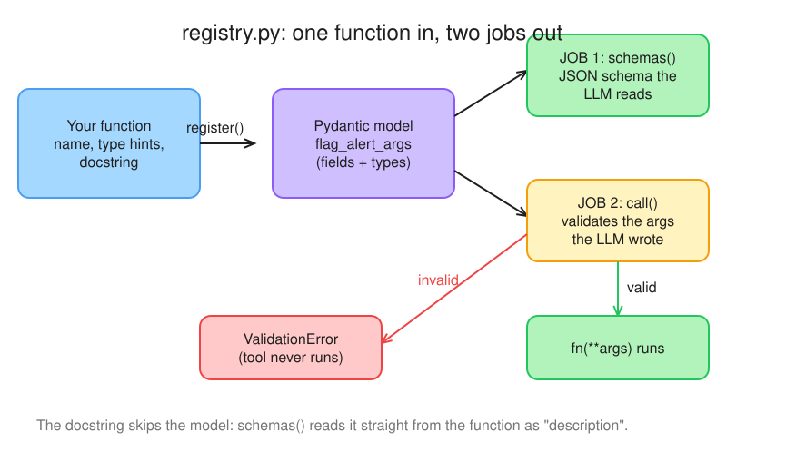
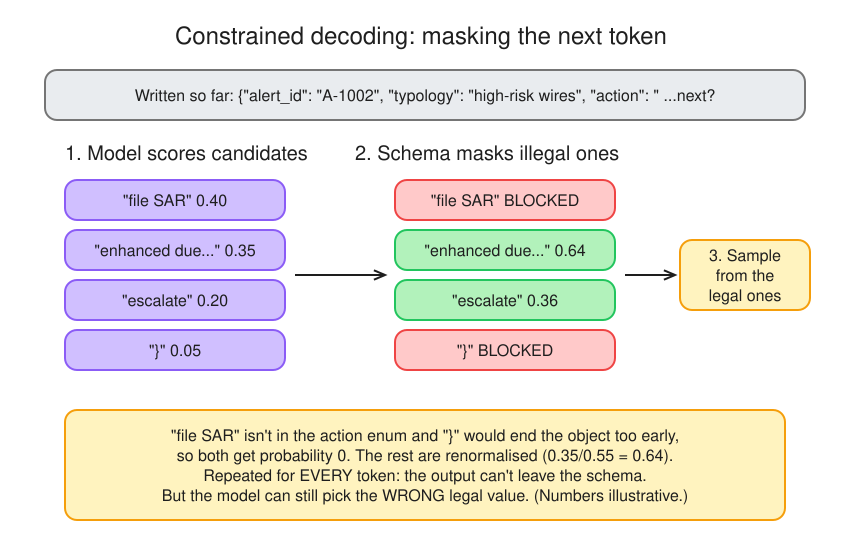

# Tools a model can't misuse

> NCP-AAI W2 D1 (AAI Day 4) · Mon 2026-10-05 · paired with GH-600 D8 (which tools each agent gets)
> Exam objectives: AAI 2.3 · 2.1 · No GPU: hosted NIM (`nvidia/nemotron-3-super-120b-a12b`)
> All data is synthetic (reuses Day 2's `react-from-scratch/tools.py`).

| File | What it is |
|---|---|
| `registry.py` | Schemas from type hints, Pydantic argument validation, idempotent `flag_alert` |
| `agent.py` | Day 2's loop, calling `registry.call()`; validation errors go back to the model |
| `desc_test.py` | Vague (`"Tool."`) vs precise descriptions, 5 runs each |
| `verdict.py` | 3-link prompt chain ending in `guided_json` (schema-constrained output) |

## §1 Bets

_Written before reading anything._

| Bet | Question | My guess | Actual | Result |
|---|---|---|---|---|
| A | With every description replaced by "Tool.", in how many of 5 runs does the agent still use both `get_alert` and `search_policy` and give the right deadline? (win if exact or ±1) | **4 or 5** | 5/5 | ✅ win |
| B | The model calls `flag_alert` twice with the same `idempotency_key`. How many flags exist afterwards? (1 or 2) | **1** | 1 (`already flagged (A-1001: structuring)`) | ✅ win |

**Score: 2/2.**

## §2 Good tools


*Editable source: [w02d01-m1-tool-call-path.excalidraw](../../docs/diagrams/w02d01-m1-tool-call-path.excalidraw)*

Five properties of a good tool definition ([NIM function calling](https://docs.nvidia.com/nim/large-language-models/1.7.0/function-calling.html#parameters), [Anthropic appendix 2](https://www.anthropic.com/engineering/building-effective-agents#appendix-2-prompt-engineering-your-tools)):

1. **Name and description** say when to use it *and when not to*, with an example call (hazard 1).
2. **Typed, narrow arguments**: an id or enum, not free text (poka-yoke, hazard 2).
3. **Validation before it runs**, with an error text the model can act on (hazard 3).
4. **Idempotency** for side effects: an `idempotency_key` the caller reuses on retry (hazard 4).
5. **Least privilege**: read-only by default, the minimum tools per agent.

`flag_alert` changes state, so it takes an `idempotency_key`: the same key never creates a second flag.

A non-integer id, `get_alert(alert_id=1001)`, should be rejected and the validation error sent back as the tool result so the model fixes its own call (not coerced, not defaulted).

`tool_choice` takes `"none"`, `"auto"`, `"required"` or a named tool, and needs `tools` set. `parallel_tool_calls` defaults to False and needs a model that supports it.

## §3 Registry

What the model receives as the tool result (`agent.py` catches the exception, so no traceback reaches it):

```text
ERROR: ValidationError: 1 validation error for get_alert_args
alert_id
  Input should be a valid string [type=string_type, input_value=1001, input_type=int]
    For further information visit https://errors.pydantic.dev/2.13/v/string_type
```

Could a model fix its call from it? My answer: **no**, too technical for the model. Counterpoint from the session: it does name the field (`alert_id`), what it got (`1001`, int) and what it wants (string), which is enough for a model to retry with `"A-1001"`. The URL and type codes are noise. Possible improvement: return only `field: message` lines plus the tool's example call.

### Registry tour (REPL, W2 D2 morning)


*Editable source: [w02d01-m2-registry-flow.excalidraw](../../docs/diagrams/w02d01-m2-registry-flow.excalidraw)*

- `register()` reads parameter **names + type hints** (into the Pydantic model) and the **docstring** (only `schemas()` uses it, as `description`). It never reads the body. It stores `(fn, Model)`.
- `Model.model_json_schema()` has no description; `schemas()` wraps it as `{type: function, function: {name, description, parameters}}`.
- Default model: int id ❌, missing key ❌, **extra field ✅ silently dropped** (Pydantic `extra="ignore"`), **junk id `"  banana "` ✅**. Validation checks shape, not meaning.
- Poka-yoke model (`Field(pattern=r"^A-\d{4}$")` + `ConfigDict(extra="forbid")`): all four ❌, the valid call ✅. The pattern also appears in the schema, so the LLM sees the rule before it calls.

## §4 Descriptions test

`desc_test.py`: same question ("Is alert A-1002 something we must act on, and by when?"), 5 runs with the real descriptions, 5 with every description replaced by `"Tool."` (names and parameters kept). OK = called both `get_alert` and `search_policy` and the answer has the 5-business-day deadline.

| Menu | Score | Steps |
|---|---|---|
| vague (`"Tool."`) | **5/5** | 3–4 |
| precise | **5/5** | 3–4 |

- Vague never failed, so there was no wrong behaviour to observe.
- Why: the **names carried it**. `get_alert(alert_id)` and `search_policy(query)` describe themselves, the menu is only 4 tools, and the question names an alert id. A good name is the first (and most-read) part of the description.
- Descriptions start to matter when names can't carry the meaning: many similar tools (`get_alert` vs `get_case` vs `get_customer_alerts`), cryptic names (`tool_7`, internal API names), or rules a name can't show (side effects, "call X before Y", input formats like `A-\d{4}`).
- **This example's conclusion, not a general one:** 1 question, 4 well-named tools, 1 model, 5 runs each, crude grader. Anthropic's tool docs say the opposite in general: "Provide extremely detailed descriptions. This is by far the most important factor in tool performance" ([Best practices for tool definitions](https://platform.claude.com/docs/en/agents-and-tools/tool-use/define-tools#best-practices-for-tool-definitions)). Real agents have dozens of overlapping tools, where names stop being enough.
- Follow-up `desc_test_anon.py` (names hidden too: `t1..t4`, `"Tool."`, schema title removed): **anon 5/5** (my prediction: 5/5 ✅). The model still saw `t1(alert_id)`, `t2(query)`, `t3(expression)`: **parameter names** were enough of a clue on this easy task. Only cost: one extra `calculator` call in run 2 and a few 4-step runs.
- Lesson: this test measured a **best case** for vague descriptions. To see descriptions earn their keep, rename the tools to `t1..t4` and rerun.

## §5 Constrained output


*Editable source: [w02d01-m4-constrained-decoding.excalidraw](../../docs/diagrams/w02d01-m4-constrained-decoding.excalidraw)*

- `extra_body={"guided_json": Verdict.model_json_schema()}` worked on the hosted API (NIM 1.15 form); no `nvext` fallback needed. No prose around the JSON, enums respected.
- Typology / action / policy: all 3 as expected (A-1001 escalate POL-01, A-1002 EDD POL-03, A-1003 close with note POL-04).
- **Schema-valid but wrong:** `alert_id` came back as `"N/A"`, `"Blue Harbor Imports - wires to high-risk jurisdiction"`, `"N/A"`. The prompt never contained the id (`get_alert` returns customer/pattern/amounts/window only), and `alert_id: str` allows any string.
- What constrained decoding **can't** guarantee: truth. It guarantees shape and allowed values; it can't supply facts the model wasn't given, and it only blocks what the schema forbids.
- Fix: my pick was "constrain it" (`pattern=r"^A-\d{4}$"`). That stops junk like `"N/A"`, but the model would then invent a *well-formed* id like `"A-0000"`. Better: don't ask the model for what the code already knows. Set `alert_id` in code after the call, and constrain the fields the model must choose.

