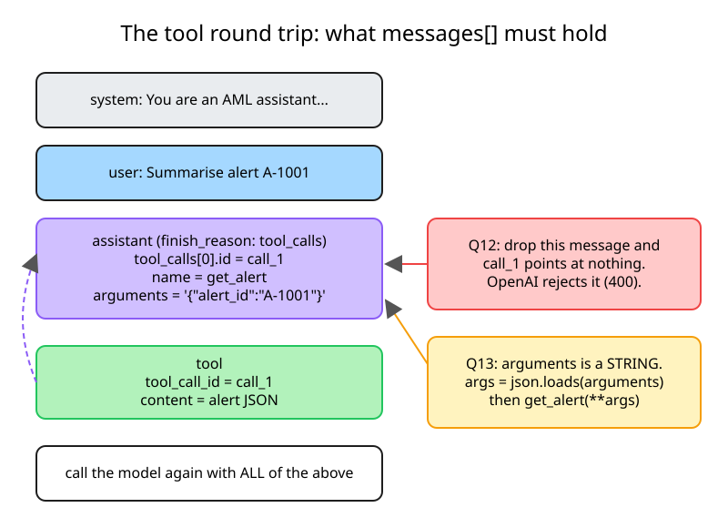
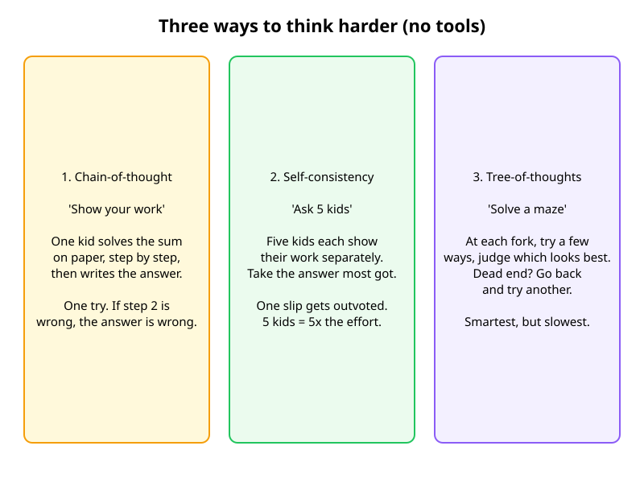
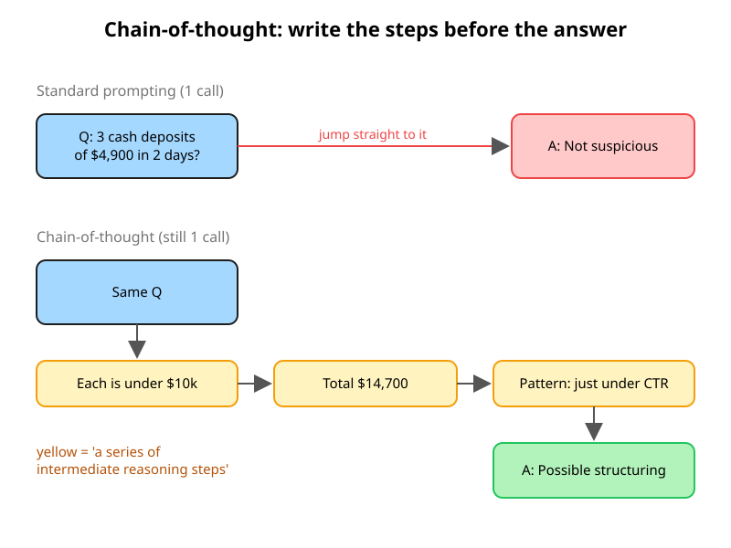
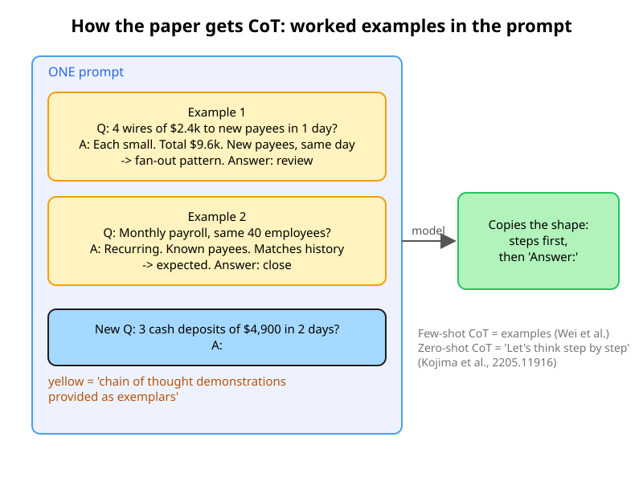
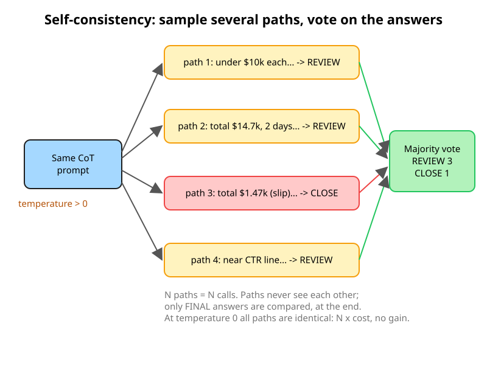
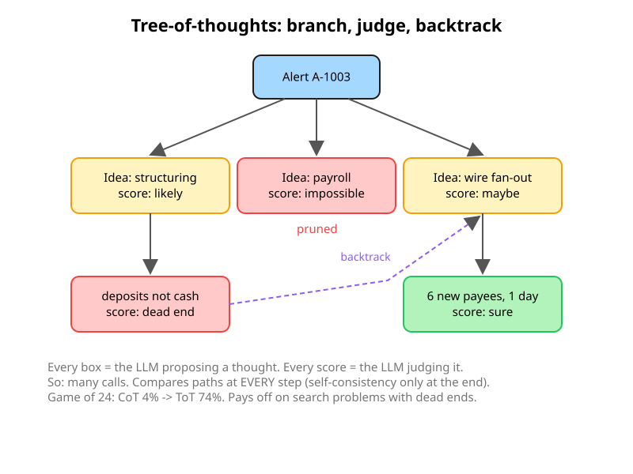
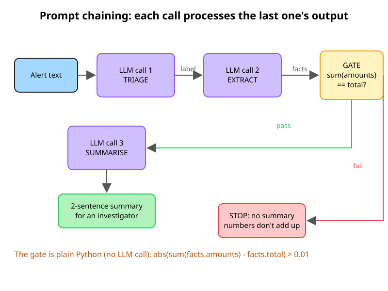

# NCP-AAI Week 1 checkpoint: patterns, prompts and the approval gate

> **Week 1 · Day 7** · Plan: `study-plans/assets/plans/NCP-AAI/week01/day07.json`
> Objectives: AAI 1.2 · 1.6 · 1.8 · 2.1 · 5.2 · 5.3 · 10.4 · Date: 2026-10-04
> Inputs: [`term-map.md`](term-map.md) · [`react-from-scratch/README.md`](../13-agents/react-from-scratch/README.md)

## 1. Ten scenario questions (closed-book)

_Answered docs closed, before revealing the answers._

| # | Question | My answer | ✅/❌ |
|---|---|---|---|
| Q1 | Exact sanctions-list match blocks a payment; no world model, no look-ahead. Reactive, deliberative or hybrid? | Reactive | ✅ |
| Q2 | Rules auto-close obvious false positives; an LLM agent plans the investigation for the rest. Architecture? | Hybrid | ✅ |
| Q3 | Short tasks, each next step depends on the last tool result. ReAct or plan-and-execute? | ReAct | ✅ |
| Q4 | Compliance reviews the **whole** plan before any tool touches customer data. Pattern, and where's the approval? | Plan-and-execute; `interrupt()` between planner and executor | ✅ |
| Q5 | Agent repeats the same thought + tool call until `max_steps`. Failure mode + two mitigations? | Repetitive loop; mitigations: `max_steps` cap, loop detection | ✅ |
| Q6 | Workers run plan steps without calling the planner again, using `#E1` placeholders. Pattern? | ReWOO | ✅ |
| Q7 | Agent writes verbal lessons from failures and reuses them, no weight changes. Technique + survey category? | Reflexion; reflection and refinement | ✅ |
| Q8 | Move from build.nvidia.com to self-hosted NIM with **no code change**. What makes that possible (1.8)? | OpenAI-compatible API; only base URL + model name change, from env/config | ✅ |
| Q9 | Two things LangGraph needs before `interrupt()` can pause and resume later; how do you resume? | Checkpointer + `thread_id`; resume with `Command(resume=...)` | ✅ |
| Q10 | NIM replies with a tool call. What must your code send back so the model can continue? | Assistant message with `tool_calls`, then `role: tool` message with matching `tool_call_id`; call again | ✅ |

**Score: 10/10** (Q1 typed; Q2–Q10 answered as multiple choice, so recognition rather than pure recall)

### Misses: doc link + what I'd say now

None this round. Mission 2 targets the spots that felt least certain.

## 2. My questions

_Five scenario questions aimed at the weak spots, each with three plausible wrong answers and the doc that settles it._

Weak spot targeted: **the tool-message shape** (AAI 1.8 / 5.x tool use). Drafted by Claude, answered blind.

| # | Scenario | Options (✔ = correct) | My answer | ✅/❌ |
|---|---|---|---|---|
| Q11 | The NIM returns **one** assistant message with **two** `tool_calls`. What do you append before calling again? | One tool msg with both results · ✔ Assistant msg + two tool msgs, each with its own `tool_call_id` · Two assistant msgs · Only the first result | Assistant msg + two tool msgs | ✅ |
| Q12 | You append the `role: tool` message but forget the assistant message that held `tool_calls`. What happens? | Works fine · Model re-calls the tool · ✔ The contract is broken: a tool message must answer a preceding assistant `tool_calls` with that id (OpenAI returns 400) · Server converts it to a user msg | Model re-calls the tool | ❌ |
| Q13 | You pass `tool_calls[0].function.arguments` straight into `get_alert(**args)` and it crashes. Why? | ✔ `arguments` is a JSON **string**, so `json.loads()` it first · It's a list · Name is inside it · Functions need a `tool_call_id` param | It's a list | ❌ |
| Q14 | How does the loop know the model wants a tool, not a final answer? | Content is empty · Role is `tool` · `finish_reason` is `stop` · ✔ `finish_reason` is `tool_calls` and `message.tool_calls` is set | `finish_reason` `tool_calls` | ✅ |
| Q15 | Triage must **always** call `get_alert` first. How do you force it? | `tool_choice="auto"` · ✔ Named `tool_choice` `{"type":"function","function":{"name":"get_alert"}}` · `temperature=0` · `tool_choice="none"` | Named `tool_choice` | ✅ |

**Score: 3/5** · Week total: **13/15**

### Misses: doc link + what I'd say now

- **Q12** · [NIM tool calling](https://docs.nvidia.com/nim/large-language-models/1.15.0/function-calling.html#basic-function-calling) · [OpenAI: function calling](https://platform.openai.com/docs/guides/function-calling): The doc example always does `messages.append(assistant_message)` **before** the tool message. The `tool_call_id` only means something if the assistant message that issued that id is in the history. OpenAI rejects the request with a 400 error. A server that doesn't validate would show the model a result answering a call it never made, so the behaviour is undefined, not a clean retry. My own code does it right: `react_from_scratch.py:57` appends `msg` with the comment *"the model must see its own tool calls on the next turn"*.
- **Q13** · [NIM tool calling](https://docs.nvidia.com/nim/large-language-models/1.15.0/function-calling.html#basic-function-calling): The doc's response shows `Function(arguments='{"location": "San Francisco, CA", ...}')`, which is a **string** of JSON, not a dict or a list. Parse it before unpacking: `json.loads(call.function.arguments)`, as in `react_from_scratch.py:74` and `hello_nim.py:39`. Malformed JSON here is also a common real failure, so it's worth a `try/except` that feeds the error back to the model.

## 3. Reasoning patterns

> Mission 5 notes. Three abstracts only: [CoT 2201.11903](https://arxiv.org/abs/2201.11903) · [Self-consistency 2203.11171](https://arxiv.org/abs/2203.11171) · [Tree-of-thoughts 2305.10601](https://arxiv.org/abs/2305.10601)

### The whole picture

All three are **reasoning** strategies with **no tools**. Think of three kids doing homework without a calculator: show your work, ask five kids, solve a maze.

### Chain-of-thought ([abstract](https://arxiv.org/abs/2201.11903))

**1. Chain of thought is the reasoning written out:** *"a series of intermediate reasoning steps"*.

- Still **one call**. The model writes its steps before committing to an answer.
- **vs ReAct (my answer):** ReAct has actions and observations, so a tool result from outside can confirm or correct a step. CoT is the model talking to itself, so a wrong number at step 2 flows straight into the answer. That is CoT's weakness: **not grounded**.

**2. It's drawn out with examples in the prompt:** *"a few chain of thought demonstrations are provided as exemplars in prompting"*.

- No fine-tuning. Worked Q → reasoning → A examples go before the new question, and the model copies their shape.
- **Exam trap:** adding *"Let's think step by step"* with **no** examples is **zero-shot CoT**, from a different paper ([Kojima et al., 2205.11916](https://arxiv.org/abs/2205.11916)). My first guess was "steering": close, but zero-shot CoT is the term to use.

### Self-consistency ([abstract](https://arxiv.org/abs/2203.11171))

**3. Sample several reasoning paths instead of one:** *"samples a diverse set of reasoning paths instead of only taking the greedy one"*.

**4. Then take the majority answer:** *"selects the most consistent answer by marginalizing out the sampled reasoning paths"*.

- Run the same CoT prompt **N times at temperature > 0**, then drop the reasoning text and **vote on the final answers**. "Marginalizing out" just means ignore the paths and count the answers.
- Answers are voted on, not reasoning, because no two paths are ever worded alike, while answers like REVIEW or $14,700 compare exactly.
- **Cost:** N paths = **N calls** (vs 1 for CoT). **At temperature 0** every path is identical, so you pay N× for no gain.
- **Best for:** short, checkable answers. Useless for open-ended output, where there's nothing to vote on.

### Tree-of-thoughts ([abstract](https://arxiv.org/abs/2305.10601))

**5. Branch, judge, backtrack:** *"considering multiple different reasoning paths and self-evaluating choices to decide the next course of action, as well as looking ahead or backtracking when necessary"*.

- **Branch:** the LLM proposes several next thoughts. **Judge:** the LLM scores each one and prunes the bad ones. **Backtrack:** at a dead end, go back to another branch.
- **When paths are compared:** self-consistency compares only **at the end** (independent paths, vote on answers). ToT compares **at every step** (it scores partial thoughts), which is what makes pruning and backtracking possible.
- My summary: CoT = one thought after another · SC = branching with no backtracking (vote at the end) · ToT = branch, score, filter, backtrack.

**6. Game of 24: 4% with CoT vs 74% with ToT:** *"while GPT-4 with chain-of-thought prompting only solved 4% of tasks, our method achieved a success rate of 74%"*.

- That gain comes from a **search** problem with many dead ends. Routine triage isn't shaped like that, so ToT is rarely worth its many calls there.

### Seven patterns in one table

| Pattern | Who plans | LLM calls per task | Best for | Weakness | Survey category ([2402.02716](https://arxiv.org/html/2402.02716)) |
|---|---|---|---|---|---|
| ReAct | The same LLM, one step at a time, inside the loop | 1 per step + final answer | Short tasks where the next step depends on the last result | Myopic; repeats thoughts/actions in loops; cost grows with steps | Task decomposition (interleaved) |
| Plan-and-execute | A planner LLM writes the whole plan up front | Planner + executor calls per step + re-planner (+ solver) | Long multi-step tasks; plans a human must approve | Plan can be wrong; serial; adapts only at re-plan time | Task decomposition (decomposition-first) |
| ReWOO | Planner writes executable steps with `#E` variables; worker is plain code | ~2 (planner + solver) | Predictable, repeatable pipelines | Can't adapt mid-run; no LLM sees results until the solver | Task decomposition (decomposition-first) |
| Reflexion | The actor plans; after a failure, self-reflection writes lessons into episodic memory | Several per attempt × retries | Tasks with a clear success signal | Slow, costly; needs a reliable failure signal | Reflection and refinement + memory-augmented |
| Chain-of-thought | The LLM, inside one answer (few-shot exemplars; zero-shot = "think step by step") | 1 | Cheap multi-step reasoning | Not grounded: an early slip carries through to the answer | Task decomposition (interleaved) |
| Self-consistency | The LLM, N independent CoT runs, majority vote on **final answers** | N | Short, checkable answers (a disposition, a number) | N× cost; needs temperature > 0; compares only at the end | Multi-plan selection |
| Tree-of-thoughts | The LLM proposes branches **and** scores them at every step; prunes, backtracks | Many (propose + evaluate per node) | Search problems with dead ends (Game of 24: 4% → 74%) | Slowest, most expensive; rarely worth it for routine work | Multi-plan selection |

_ReAct → Reflexion rows carried over from Saturday's [`react-from-scratch/README.md` §2](../13-agents/react-from-scratch/README.md)._

> **Exam line:** CoT, self-consistency and ToT are **reasoning** strategies inside one model call or a few, with no tools. ReAct, plan-and-execute and ReWOO are **agent** loops that add tools and observations.

**Worth paying for on a SAR recommendation:** *My pick:* tree-of-thoughts. *Plan's view:* self-consistency. A SAR decision is a short, checkable answer (file / don't file), so N independent runs + a vote catch a one-off slip. ToT's backtracking pays off on search problems with dead ends, which a single decision isn't. Either way, a human still approves the filing.

**Overkill for triage:** Tree-of-thoughts: many calls per alert, at triage volume, for a task that isn't a search problem.

## 4. Prompt chains (2.1)

_Lab: [`13-agents/prompting/chain.py`](../13-agents/prompting/chain.py) · Reading: [Anthropic, Building Effective Agents: "Prompt chaining"](https://www.anthropic.com/engineering/building-effective-agents#workflow-prompt-chaining)_

### Reading notes

**1. Each call feeds the next:** *"Prompt chaining decomposes a task into a sequence of steps, where each LLM call processes the output of the previous one."*

- `chain.py`: triage → label → extract → facts JSON → summarise. The order is hard-coded in `run()`.
- **vs plan-and-execute:** in plan-and-execute an **LLM planner writes the steps at runtime**, so plans differ per task. In a chain, **I write the steps in code ahead of time**, the same for every input. Tools aren't the dividing line; *who decides the path* is. Anthropic: **workflows** = predefined code paths; **agents** = the LLM directs its own process.

**2. A gate is a check in code between steps:** *"You can add programmatic checks (see 'gate' in the diagram below) on any intermediate steps to ensure that the process is still on track."*

- Why plain Python and not a 4th LLM call (my answer): so the check is done one fixed way and **isn't up for interpretation**. It's also deterministic, can't hallucinate, and costs nothing. Same idea as `check()` in Saturday's `plan_execute.py`: hard rules in code, judgment to the LLM.

**3. When to use it:** *"This workflow is ideal for situations where the task can be easily and cleanly decomposed into fixed subtasks."*

- The trade: latency for accuracy, because each call does an easier job.
- **Chain or agent?** My first pick was wrong: I put the shell-network investigation on the chain side. Corrected:
  - (a) Every alert → labelled, fact-checked summary = **chain**. Fixed steps.
  - (b) Shell-network investigation across three linked companies = **agent**. The next lookup depends on the last result.
  - Test: *can I write the steps down before seeing the data?* Yes → chain (an **assembly line**). No → agent (a **detective**).

### Runs

| Input | Output | What it shows |
|---|---|---|
| `A-1001` | `[STRUCTURING]`, amounts 9,500 + 9,400 + 9,600 = total 28,500, 7 days → 2-sentence summary | Happy path; the gate passed |
| `A-1003` | `[PAYROLL]`, 3 × 4,200 = 12,600, 30 days → summary | Happy path; the gate passed |
| `"What's the weather tomorrow?"` | `stopped at step 1: out of scope` | The contract's refusal rule; steps 2–3 never ran |
| `A-1001` with `facts.total += 1` | `stopped at the gate: amounts sum to 28500.0, model said total 28501.0` | The gate catches a bad extraction **before** the summary (temp line removed after the run) |

_`chain.py` reads `NVIDIA_API_KEY` from `00-environment/.env`, like `react_from_scratch.py`._

### Questions

**Which line of `CONTRACT` is which?** My answer for the refusal rule: the *Scope* line ❌. Corrected:
- **Role:** `You are step {step} of an AML alert pipeline at a bank.`
- **Scope:** `Scope: use only the input you are given. Never invent amounts, names or policies.` This limits *what it may use*.
- **Refusal rule:** `If the input is not a transaction-monitoring alert, reply exactly: OUT_OF_SCOPE`. This says *what to do with input it shouldn't handle*, as an exact string that code can test (`if label == "OUT_OF_SCOPE"`).
- **Output format:** `Output: {output}`

**Why is this a workflow, and when would it become a ReAct agent?** ✅ When **the next step depends on the data**: for example, STRUCTURING means pulling 90 days of history, while PAYROLL means checking the employer, so the path differs per alert. Volume, JSON strictness or cost don't change who decides the path.

**Validate-and-retry vs constrained decoding (Day 5's `guided_json`): what does each guarantee?** ✅
- **Validate-and-retry:** catches bad output *after* generation and shows the model its error. It can **still fail** after the last retry (`raise`).
- **Constrained decoding:** the decoder can only emit tokens that fit the schema, so invalid JSON is **impossible**.
- **Neither guarantees correct values.** A schema-valid `"total": 28501` passes both, and that's why the **gate** exists.

## 5. Reflection

- **What I'd explain differently to my team now:** workflow vs agent. The question is *who decides the path*: code decides it in a workflow (an assembly line, e.g. a prompt chain), and the LLM decides it in an agent (a detective, e.g. ReAct). Tools don't settle it.
- **Still fuzzy enough that I'd guess on the exam:** when to pick self-consistency vs tree-of-thoughts. Rule to drill: short, checkable answer → **self-consistency** (vote at the end); a search with dead ends → **tree-of-thoughts** (score and backtrack at every step).
