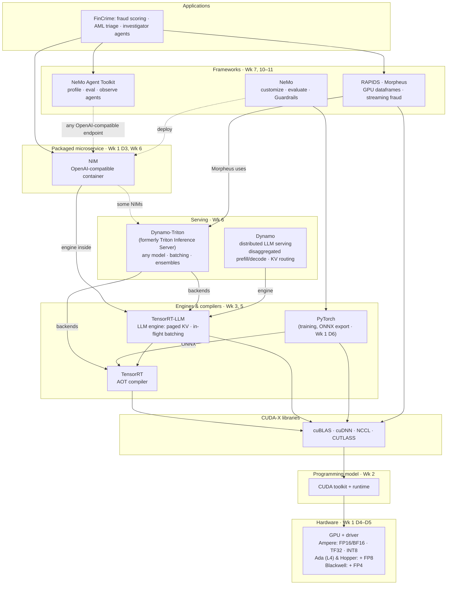

# Week 1 review: NVIDIA ecosystem, GPU fundamentals & environment

> **Week 1 · Day 7** · Deliverable for `nvidia/week-01/day-07`
> Status: **draft for review** · Last updated: **2026-09-30**
> Inputs: [`nvidia-stack.md`](nvidia-stack.md) (Day 2) · [`cpu-vs-gpu.md`](cpu-vs-gpu.md) (Day 4) · [`gpu-memory.md`](gpu-memory.md) (Day 5) · [`pytorch-primer`](../00-environment/pytorch-primer/) (Day 6)

> ⏳ **Review note.** This was drafted for you. The quiz answers are a model answer set, not your no-lookup
> attempt. Cover the answers and try each question before reading, and rewrite any answer you'd put differently.

---

## 1. Week 1 at a glance

| Day | Deliverable | State |
|---|---|---|
| 1 · Environment | `00-environment/versions.md` | ✅ committed; Stack fields still blank (fill on next pod session); FP8 burst-tier error fixed 09-30 |
| 2 · Stack map | `docs/nvidia-stack.md` (v1) | ✅ committed |
| 3 · NIM quick win | `05-nim/quickstart-fastapi`, `quickstart-nestjs` | ✅ committed |
| 4 · CPU vs GPU | `01-cuda/matmul-bench/` + `docs/cpu-vs-gpu.md` | 🟡 code + predictions + analysis ready; **L4 sweep not run** |
| 5 · GPU memory | `01-cuda/vram-lab/` + `docs/gpu-memory.md` | 🟡 code + KV math + predictions ready; **OOM boundary not measured** |
| 6 · PyTorch & ONNX | `00-environment/pytorch-primer/` | 🟡 runs and passes (reference run in a cloud container); **re-run on the Mac and retype the loop from memory** |
| 7 · Review | this doc | 🟡 draft |

**Both open GPU items fit in one L4 session (≈ 25 min, ≈ $0.25).** Run `matmul-bench` and then `vram_probe.py` on the same pod
before Week 2 Day 1 starts, and Week 2 Day 1 can reuse the pod.

## 2. Self-quiz: model answers

**What is an SM?**
A Streaming Multiprocessor: the GPU's building block. Each SM has its own CUDA cores, Tensor Cores, registers,
shared memory/L1 and warp schedulers. A kernel's thread blocks are spread across SMs, so small problems that
create fewer blocks than there are SMs leave hardware idle.

**What is a warp?**
32 threads that execute the same instruction together (SIMT). It's the real unit of scheduling. If threads in a
warp take different branches, the branches run one after another with the other threads masked off (divergence).

**What is a Tensor Core?**
A unit that does a small matrix multiply-accumulate (a tile) per instruction instead of one scalar FMA. It's why the
L4's dense peaks go FP32 30.3 → TF32 60 → FP16 121 → FP8 242.5 TFLOPS. You only get it through reduced precision
and matmul-shaped work.

**CUDA vs TensorRT vs Triton vs NIM vs NeMo: one line each, and when is each NOT the answer?**

| Tech | What it is | Not the answer when… |
|---|---|---|
| CUDA | The programming model and runtime everything else compiles down to | You'd be hand-writing kernels for something cuBLAS/cuDNN/PyTorch already does |
| TensorRT | Ahead-of-time compiler: turns a fixed model graph into an optimized engine for one GPU | Rapid iteration (rebuild on every change), non-NVIDIA targets, or LLMs (use TensorRT-LLM) |
| Triton (Dynamo-Triton) | Multi-model, multi-framework inference server: dynamic batching, ensembles, many backends | One model behind one simple API where FastAPI + one engine is enough, or distributed LLM serving at scale (use Dynamo) |
| NIM | A pre-built, optimized, OpenAI-compatible model container (TRT-LLM or vLLM inside) | You need a model or architecture NVIDIA doesn't package, full control of the engine, or a hosted SaaS API is fine |
| NeMo | Framework to train, customize, evaluate and guard models (plus Guardrails and the Agent Toolkit) | You only need to *call* a model, or a quick single-GPU fine-tune where HF PEFT/TRL is simpler |

**Which precisions does *your* rented card support, and which weeks does that gate?**
L4 = Ada Lovelace, compute capability 8.9: **FP32, TF32, FP16/BF16, INT8 and FP8** on Tensor Cores
([L4 product page](https://www.nvidia.com/en-us/data-center/l4/)). **No FP4** (that's Blackwell).
So the FP8 labs (Week 3 Day 3 LLM quantization, Week 5 Day 4 TRT-LLM FP8) run on the default L4.
The earlier plan note ("FP8 needs Hopper", A100 as the FP8 burst card) was wrong; fixed in `versions.md` on 09-30.
Only the VRAM ceiling (24 GB) forces a bigger card, never precision.

**Why does a model OOM with compute to spare?**
Compute is a rate, VRAM is a capacity. Weights are a fixed cost, but the KV cache grows with
batch × context × layers × KV heads, and prefill activations grow with tokens in flight. Llama-3.1-8B on an L4:
~15 GiB of weights leave ~7 GiB, which holds ~57k cached tokens in total, so 16 users × 4k context already doesn't fit
(details in [`gpu-memory.md`](gpu-memory.md) §3).

**Is Triton superseded by Dynamo, renamed, or adjacent?** *(Day 2's open question)*
**Renamed *and* adjacent.** Triton Inference Server is now called **NVIDIA Dynamo-Triton**: same server, new name.
**NVIDIA Dynamo** is a separate framework for distributed LLM serving (disaggregated prefill/decode, KV-aware routing).
NVIDIA says it *complements* Dynamo-Triton; it doesn't replace it
([Dynamo-Triton page](https://developer.nvidia.com/dynamo-triton), checked 2026-09-30).
Exam tip: questions may use either name.

## 3. Stack diagram v2 (from memory)

What changed from v1: Triton is labelled Dynamo-Triton; precision support per GPU generation is on the hardware box;
the grey alternatives are dropped to show only the NVIDIA dependency spine; each layer notes which week goes hands-on.

## 4. Money check

| Day | GPU used? | Logged spend |
|---|---|---|
| 1 | L4, setup | $0.30 (check the "21 hours" entry, which is probably minutes) |
| 2, 3, 6, 7 | none (build.nvidia.com hosted NIM, MacBook) | $0 |
| 4, 5 | **not yet run** | $0 so far; expect ≈ $0.25 for one combined session |
| **Week 1 total** | | **≈ $0.30 of the ~$100–160 envelope** |

- [ ] Nothing running in the RunPod console; no orphaned volume billing at the stopped rate (check in the console; I can't see it from here)
- [x] `versions.md` reflects reality, and the change log records the 09-30 FP8 correction

## 5. Week 2 tier

**L4 for Days 1–4** (CUDA execution model, transfers & streams, Nsight profiling, mixed precision). Book a **2×L4** pod for the
Saturday multi-GPU lab (Day 6: DDP vs FSDP). Note: L4s have no NVLink, so that lab's all-reduce goes over PCIe. That's a
useful thing to *see* in the profile, not a problem.

## 6. Reflection (yours to write)

- What did I build or measure this week?
- What surprised me or broke, and why?
- Production / financial-crime implication?
