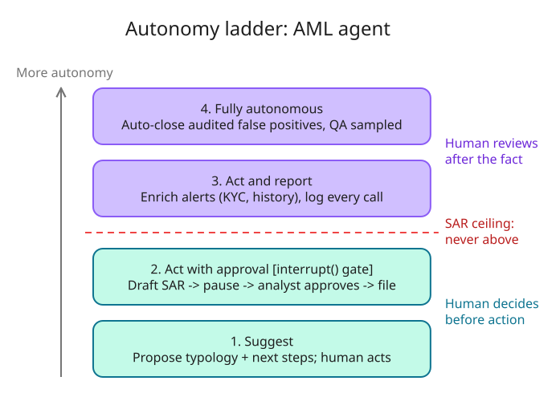
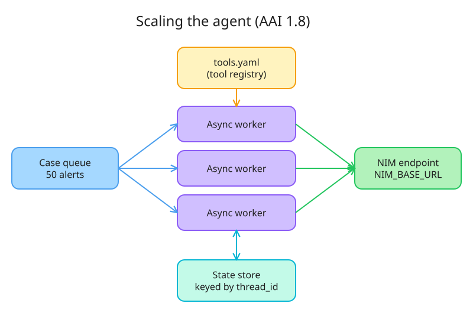

# AAI architecture map (NCP-AAI W1 D5)

**Bet A** — my ADK platform today is: _reactive / deliberative / hybrid_ → **Deliberative**
**Bet B** — first-try tool call from the hosted NIM: _yes / no_ → **Yes**

## §1 Vocabulary

- **Workflow**: the developer owns the control flow; LLM calls run along predetermined code paths in a fixed order (chaining, routing, parallelization).
- **Agent**: the LLM owns the control flow; it decides its own steps and which tools to call, in a feedback loop until done.
- **Reactive**: perception → action via rules or a learned policy; no world model, no look-ahead. *AML*: a screening rule that blocks a payment on an exact sanctions-list hit.
- **Deliberative**: keeps a model of the world and plans/searches before acting. *AML*: an investigator agent that plans which accounts, transactions and KYC docs to pull before drafting a case narrative.
- **Hybrid**: reactive layer for the fast routine loop, deliberative layer for goals, constraints and re-planning. *AML*: rules auto-close obvious false positives; ambiguous alerts go to a planning agent.

**Workflow patterns** (most fixed → most autonomous; LangGraph "Workflows and agents")
- **Prompt chaining**: each LLM call's output feeds the next. *AML*: extract entities from an alert → summarise → draft narrative.
- **Parallelization**: independent LLM calls run at once, results aggregated. *AML*: screen a customer against sanctions, PEP and adverse media simultaneously.
- **Routing**: classify the input, send it down one specialised branch. *AML*: route an alert to the structuring, TBML or sanctions handler by typology.
- **Orchestrator-worker**: an LLM splits the task at runtime and delegates subtasks to workers, then synthesises. *AML*: orchestrator decides which counterparties need a deep-dive and spawns one worker each.
- **Evaluator-optimizer**: one LLM generates, another critiques against criteria, loop until it passes. *AML*: draft SAR narrative → QA reviewer checks who/what/when/where/why → revise.
- **Agent**: an LLM calling tools in a feedback loop until it decides it's done.

**Reasoning & orchestration**
- **Goal-oriented reasoning**: work back from a goal: decompose into subgoals, choose actions that make progress, check progress, stop when met or unreachable. *AML*: goal "is this alert suspicious?" → subgoals: profile, pattern, history, disposition.
- **Chain-of-thought (CoT)**: prompt the model to reason in intermediate steps before answering; better multi-step reasoning and an inspectable trace.
- **ReAct** (Yao et al., 2022; AAI 1.2): interleave Thought → Action (tool call) → Observation, repeat until answer. Grounds reasoning in real data; plans only one step ahead.
- **Plan-and-execute**: write the whole plan first, then run the steps (often with human approval of the plan). Contrast with ReAct; that's W1 D6.
- **Tool orchestration with error handling**: choose, sequence and parallelise tool calls; validate model-generated args; timeouts, retries with backoff, fallbacks; return errors to the model as observations so it recovers instead of hallucinating. *AML*: `get_alert` times out → retry once → return `{"error": "unavailable"}` → agent says it can't assess.

## §2 My ADK platform

- **Workflow vs agent**: no workflow agents left: we moved off `SequentialAgent` / `ParallelAgent` / `LoopAgent`; every node is now `Agent` (= `LlmAgent`), so an LLM owns the control flow at every level.
- **Deliberative layer**: the top-level agent plans ahead; sub-agents act step by step (ReAct-style) on the parts it hands them.
- **Reactive layer**: deterministic rules (callbacks / validation) act without asking an LLM: blocking, short-circuiting or auto-handling cases.
- **Verdict: hybrid**: reactive rules for the fast, predictable loop + a planning LLM layer for goals and re-planning. (Bet A said deliberative: miss; the planner is real, but the rules layer makes it hybrid.)

## §3 Autonomy ladder

| Rung | Who acts | AML action |
|---|---|---|
| 1. **Suggest** | Agent proposes, human does everything | Propose a typology (e.g. structuring) and next investigative steps for an alert |
| 2. **Act with approval** ⛔ *gate* | Agent prepares, **pauses**, human approves/rejects, then it executes | Draft the SAR narrative; recommend an account block or customer exit |
| 3. **Act and report** | Agent acts, human reviews the log after | Auto-enrich alerts with KYC, transaction history and adverse media; every tool call logged |
| 4. **Fully autonomous** | Agent acts, humans only sample | Auto-close alerts matching a documented, audited false-positive rule, with QA sampling |

- **Gate**: sits on rung 2, *before* the action executes: `interrupt()` pauses the graph and saves state (checkpointer + `thread_id`), the analyst decides, and `Command(resume=...)` continues or branches.
- **Never above rung 2**: **filing a SAR**: irreversible, regulated, a named human must own it. Same for freezing/blocking accounts.
- Maps to **AAI 10.4** (human oversight and intervention for accountability and trust).

*Source: [diagrams/w01d05-autonomy-ladder.excalidraw](img/w01d05-autonomy-ladder.excalidraw)*

## §4 Built to swap and scale

- **Pluggable LLMs** (AAI 1.8): `NIM_BASE_URL` + `AGENT_MODEL`: hosted → self-hosted NIM, or a new model, is a config change, not a code change.
- **Stateless workers + external state**: keep the full message list (user turns, `tool_calls`, `role: "tool"` observations) plus run state (case id, plan, current step, pending approval) in a DB / Redis / checkpointer keyed by `thread_id`. Any worker can load and resume; same foundation `interrupt()` needs.
- **50 at once**: `AsyncOpenAI` + `await` so a worker doesn't block while NIM thinks; a case queue feeding N stateless workers; scale out by adding workers.
- **Add a tool without code**: declare tools in config (a registry / workflow YAML, like NeMo Agent Toolkit on W2 D3); workers load the tool list at startup instead of a hard-coded `TOOLS`.

*Source: [diagrams/w01d05-scale-out.excalidraw](img/w01d05-scale-out.excalidraw)*

## Q&A from the session

**Q: What do "reactive, deliberative and hybrid systems, goal-oriented reasoning, CoT prompting and tool orchestration with error handling" each mean?**
A: Architecture decides *who plans*: reactive = rules, no look-ahead; deliberative = world model + planning; hybrid = both in layers. Goal-oriented reasoning and CoT are *how* it plans: decompose a goal into subgoals; reason in intermediate steps. Tool orchestration is how the plan touches the world safely: validate args, timeouts, retries/backoff, fallbacks, and return errors to the model as observations. (Definitions in §1.)

**Q: What is ReAct?**
A: Reason + Act (Yao et al., 2022; [arXiv 2210.03629](https://arxiv.org/abs/2210.03629)). Loop: Thought → Action (tool call) → Observation → … → answer. Beats CoT-only (hallucinates facts it never looked up) and act-only (no plan, can't recover). Weakness: plans one step ahead → plan-and-execute (W1 D6). `hello_nim.py` is one ReAct turn. Exam cue: "interleaving reasoning traces with tool calls and observations" = ReAct (AAI 1.2).

**Q: What are temperature and top_p?**
A: Both control how the next token is sampled from the model's probability distribution.
- **Temperature** sharpens or flattens the *whole* distribution (logits ÷ T). Low → the favourite dominates (predictable; ~0 = greedy). High → flatter, underdogs get picked (creative → erratic). The *ranking* never changes, only the gaps.
- **top_p** (nucleus sampling) keeps the most likely tokens until their probabilities **add up to p**, drops the rest, renormalises, then samples. It is a probability mass, **not** "the top p% of tokens" (classic trap).
- Example: structuring 0.70 / smurfing 0.20 / laundering 0.07 / tax 0.02 / pizza 0.01 → `top_p=0.95` keeps the first three (0.97).
- `hello_nim.py` uses `temperature=1.0, top_p=0.95` because the Nemotron 3 Super model card asks for it, even for tool calling; reasoning models can loop/repeat when forced greedy. Follow the model card over the "temp 0 for tools" rule of thumb. Tune one at a time.

**Q: What is top_k?**
A: Keep only the **k** most likely tokens, then sample. Fixed count vs top_p's adaptive mass: when the model is confident top_p keeps 1 token while top_k=40 still keeps 40; when it's unsure top_p keeps many while top_k may cut good options. Often used as a safety cap (`top_k=50, top_p=0.95`). Order: temperature → top_k → top_p → sample. `top_k=1` = greedy; 0/unset = no limit (most libraries).

**Q: Does top_p exist in other frameworks? (ADK has temperature.)**
A: Yes, almost everywhere:
- ADK: `LlmAgent(generate_content_config=types.GenerateContentConfig(temperature=1.0, top_p=0.95, top_k=40))`
- OpenAI-compatible / hosted NIM: `chat.completions.create(..., top_p=0.95)`
- LangChain: `ChatNVIDIA(..., temperature=1.0, top_p=0.95)`
- NeMo Agent Toolkit: `llms:` block of the workflow YAML
- HF `transformers`: `generate(do_sample=True, top_p=..., top_k=...)`; vLLM `SamplingParams(top_p=...)`; TensorRT-LLM sampling config
Defaults differ per provider (silent behaviour change when swapping models, AAI 1.8), and some reasoning models restrict or prescribe them: check the model card.

**Q: How does the interrupt / approval step relate to NCP-AAI?**
A: It's objective **10.4**: *"Enable human oversight and intervention for accountability and trust"* (Domain 10, Human-AI Interaction and Oversight, 5%). The ladder decides *where* a human sits; `interrupt()` + checkpointer is *how*; "SAR never above act-with-approval" is the accountability. Also touches 10.3 (traceability), 1.2 (gate sits between Action and execution) and Domain 9 (compliance). Exam tests the pattern, not LangGraph; it returns with NeMo Agent Toolkit (W2 D3) and the approval gate (W5 D5). Source: [NCP-AAI study guide](https://dam-cdn.nvd.orangelogic.com/AssetLink/64tei188l3tt132l265u1ipjoexdl1p5.pdf).

**Q (M4): Which two env vars swap the model or point at self-hosted NIM?**
A (mine): `NIM_BASE_URL` and `AGENT_MODEL`. ✅ Config change, not code change.

**Q (M4): What to store outside the process so any worker can continue?**
A (mine): the history of each interaction with the NIM service. ✅ Refined: the full message list *including* `tool_calls` and `role: "tool"` observations, plus run state (case id, plan, step, pending approval), in a DB/Redis/checkpointer keyed by `thread_id`.

**Q (M4): How to run 50 at once, and add a tool without code?**
A: `AsyncOpenAI` + `await` (don't block while NIM thinks), a case queue feeding N stateless workers; tools declared in a config registry/YAML loaded at startup (NeMo Agent Toolkit style). See diagram in §4.

**Q: What does "rung" mean?**
A: A rung is one step (bar) of a ladder. On the autonomy ladder each rung is one **level of autonomy**: 1 Suggest → 2 Act with approval → 3 Act and report → 4 Fully autonomous. "SAR never above rung 2" = a SAR always needs human approval before it's filed.

**Q: Which rung does each step of GH-600 W1 D5 map to?**
A: GH-600's ladder (suggest → draft PR → PR with checks → auto-merge) maps to rungs 1 → 2 → 2 + checks gate → 4; there is no GH-600 rung 3. Assigning to Copilot = rung 2; steering = intervention at rung 2; `copilot/` branch = containment below rung 4; CI approval = rung 2 + gate; the bypass actor = jumping from rung 2 to 4; session logs = the "report" of rung 3. Full table and diagram: [term-map.md](term-map.md).

## Lessons learnt

- **Bet A: miss** (guessed deliberative → actually **hybrid**). I classified the platform by its most impressive part, the planner. The deterministic callbacks are a reactive layer, so the whole system is hybrid. Classify the *whole* system.
- **Bet B: win.** Hosted Nemotron 3 Super returned a `get_alert` tool call on the first try and used the observation correctly (flagged "just under the $10,000 threshold" on its own).
- ADK's `Agent` is an alias for `LlmAgent`: moving off `Sequential/Parallel/LoopAgent` turned our workflows into agents (the LLM now owns control flow everywhere).
- top_p is probability mass, not a percentage of tokens; temperature changes gaps, never ranking.
- The checkpointer + `thread_id` is the shared foundation for both scaling (stateless workers) and human approval (`interrupt()`).

## Reflection

- **Closest GH-600 ↔ runtime twin**: *Draft PR ↔ `interrupt()`*: in both, the work is done but waits for a human before it takes effect.
- **No twin**: *rung 3, act and report*: runtime agents have it (act freely, human reviews the log after); GH-600's ladder jumps from PR-with-checks straight to auto-merge.
- **Day-one rung for an AML agent at my bank: 1, Suggest.** Why: (1) no validation history yet: model risk needs performance evidence before granting any autonomy; (2) regulatory accountability: dispositions and SARs must be owned by a named human; (3) earn trust, then climb: run alongside analysts, measure, and promote action-by-action up the ladder.
