# ReAct vs Plan-and-Execute with a human gate

> NCP-AAI W1 D6 (AAI Day 2) · Sat 2026-10-03 · paired with GH-600 D6 capstone (planner → approve → implementer)
> Exam objectives: AAI 1.2 · 1.6 · 5.2 · 5.3 · 10.4 · No GPU: hosted NIM (`nvidia/nemotron-3-super-120b-a12b`)
> All data is synthetic.

| File | What it is |
|---|---|
| `tools.py` | 3 tools (`get_alert`, `search_policy`, AST-safe `calculator`) over synthetic alerts + policies |
| `react_from_scratch.py` | Bare ReAct loop, two exits: answer or `MAX_STEPS` (you type the loop) |
| `plan_execute.py` | Planner → `check()` auto gate → `input()` human gate → executor (mini ReAct per step) → solver |
| `questions.json` | 5 investigations with expected answers (Q5 is unanswerable on purpose) |
| `race.py` | Runs both patterns on all 5 questions (plans auto-approved), writes `results.json` + `trace.log`, prints a scoreboard (replaces the guide's `python -c ... | tee`, which Windows `cmd` lacks) |
| `results.json` / `trace.log` | Race output (Mission 5) |
| `react_reference.py.txt` | Reference `run()`: peek only after typing yours |

## §1 Bets

_Written before reading anything._

| Bet | Question | My guess | Actual | Result |
|---|---|---|---|---|
| A | Correct ReAct answers on first run (of 5); win if exact or ±1 | **5** | 4 | ✅ win (off by 1) |
| B | Fewer total LLM calls across 5 questions | **ReAct** | ReAct (25 vs 48) | ✅ win |
| C | On Q5 (answer not in data), which pattern invents an answer? | **Plan-and-execute** | Both | ❌ miss |

**Score: 2/3.**

## §2 Pattern table

### Reading notes: ReAct ([arXiv 2210.03629 §2](https://arxiv.org/html/2210.03629#S2))

**1. A thought changes nothing in the environment and returns no observation; it only updates the context for the next step.**

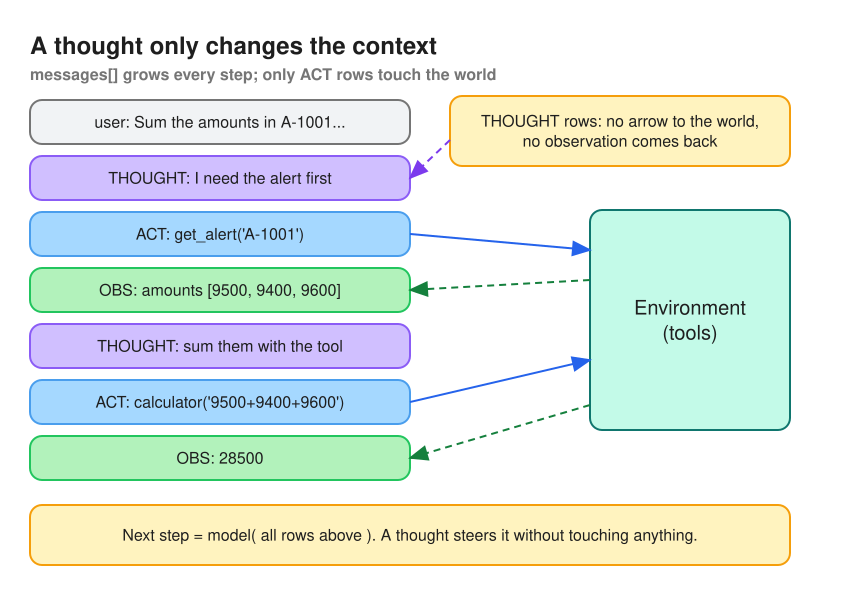

- Only ACT rows reach the tools; OBS rows come back; THOUGHT rows just add text to `messages`.
- Next action = model(whole context), π(aₜ | cₜ). In code: thought = `msg.content` (may be empty), action = `msg.tool_calls`, observation = `role: tool` message.

**2. Thoughts decompose goals, inject knowledge, extract key facts from observations, track progress and handle exceptions.**

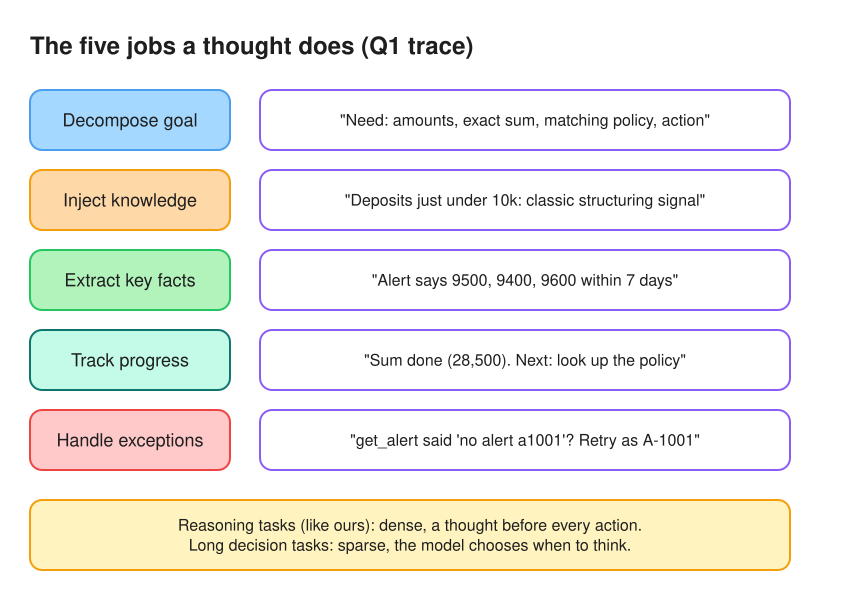

- Inject knowledge is where hallucination can slip in; track progress prevents repeat calls; handle exceptions works because tool errors come back as `ERROR: ...` observations.
- Reasoning tasks: dense thoughts (before every action). Long decision tasks: sparse, the model decides when.

**3. Failure modes (§3.3): CoT's main one is hallucination; ReAct's is reasoning errors, including repeating its previous thoughts and actions in a loop.**

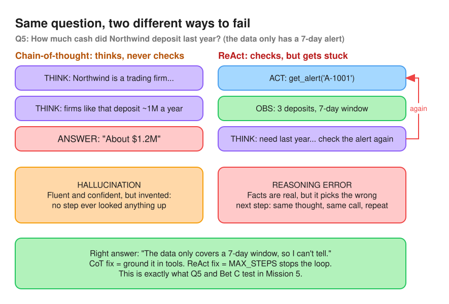

- CoT never checks anything, so when it doesn't know it invents a fluent answer (hallucination: 56% of CoT's failures; false positives 14% vs ReAct's 6%).
- ReAct's facts come from tools, so it rarely invents; it fails by choosing the wrong next step, often repeating the same thought and call (reasoning error). Non-informative search causes 23% of its errors.
- Analogy: CoT is the analyst who writes the report from memory; ReAct is the analyst who keeps re-pulling the same record. Fixes: ground in tools / `MAX_STEPS` + progress tracking.

### Reading notes: Plan-and-execute ([LangChain blog](https://www.langchain.com/blog/planning-agents))

**1. ReAct's two downsides: one LLM call per tool invocation, and it plans only one sub-problem at a time.**

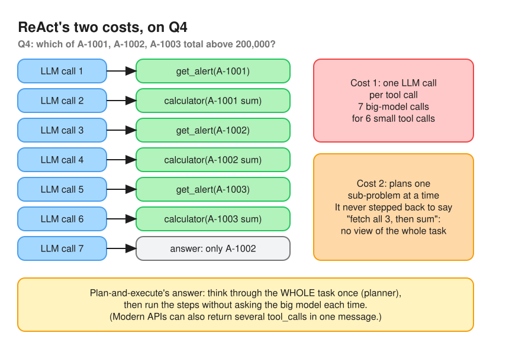

- Cost 1 is money and latency: the big model is consulted before every tool call (Q4 ≈ 7 LLM calls for 6 tool calls).
- Cost 2 is quality: it only looks one step ahead, so it may take a sub-optimal path because it never reasons about the whole task.
- Native parallel `tool_calls` soften cost 1 a little, but don't fix cost 2.

**2. Plan-and-execute: a planner writes a multi-step plan, executors run each step, then a re-planning prompt decides to finish or re-plan.**

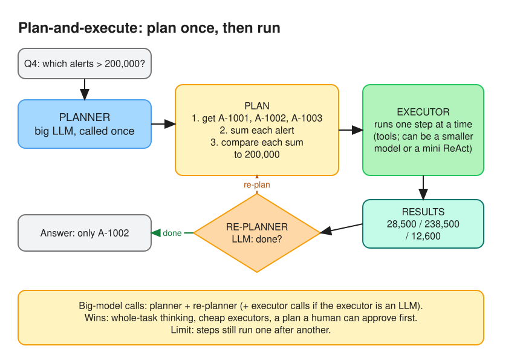

- Planner (big LLM, once) reasons about the whole task; executors (tools, a smaller model, or a mini ReAct) run steps without consulting it; re-planner decides done vs new plan (objective 5.3: replanning on failure).
- The plan is an artifact a human can approve before any tool runs. Limit: steps still run serially, and a wrong plan is only caught by the re-planner or the gate.

**3. ReWOO: the plan uses variables (`#E1`, `#E2`) so workers run without re-consulting the planner; a Solver writes the answer.**

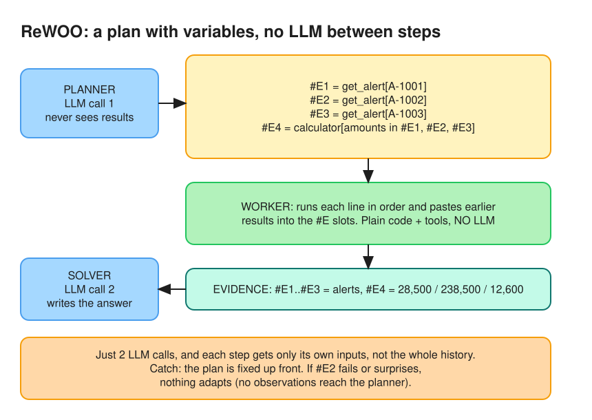

- "Reasoning WithOut Observations": the planner never sees tool results. Worker = code that runs each line and substitutes `#E` values; Solver = one LLM call over plan + evidence. About 2 LLM calls total, and each step sees only its inputs.
- Catch: no adaptation. If a step fails or surprises, nothing re-plans.

| | ReAct | Plan-and-execute | ReWOO |
|---|---|---|---|
| LLM sees tool results while working? | every step | at re-plan time | only the Solver |
| Big-model calls | 1 per step | planner + re-planner (+ executor) | ~2 |
| Adapts mid-task? | yes, every step | yes, via re-planner | no |

**Q: Is the difference that ReWOO keeps a store of results so the worker never goes back to the planner?**
Partly. Neither pattern consults the planner between steps. The difference is who works out each step: in plan-and-execute an LLM executor reads a plain-English step plus findings so far and decides the tool call, and a re-planner can adapt; in ReWOO the planner already wrote the tool calls with `#E` placeholders, so the worker is plain code that substitutes stored values, and no LLM looks at results until the Solver. The variable store is how ReWOO wires dependencies without an LLM in the loop.

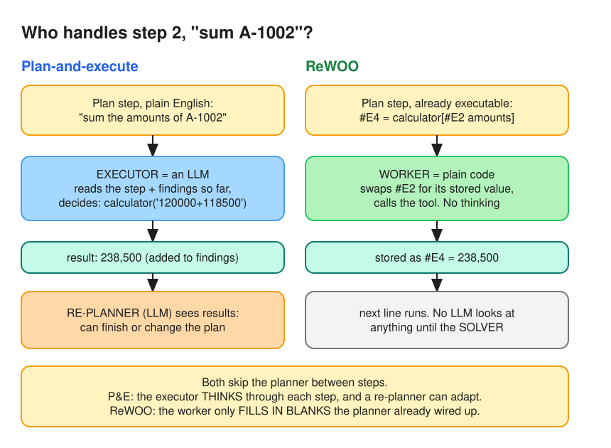

### Reading notes: Planning survey ([arXiv 2402.02716, Fig. 1](https://arxiv.org/html/2402.02716))

**1. Five ways agents plan: task decomposition, multi-plan selection, external planner-aided, reflection and refinement, memory-augmented.**

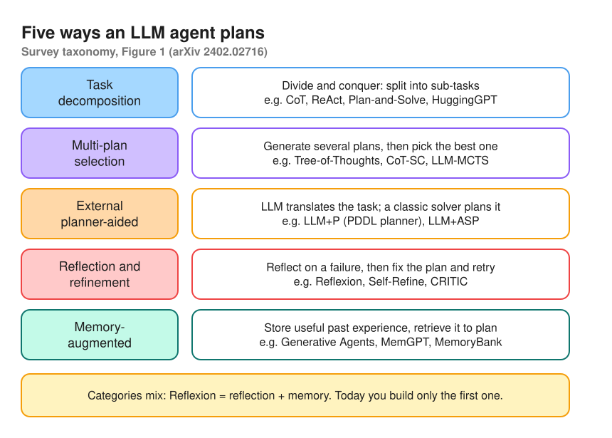

- Decomposition = divide and conquer (CoT, ReAct, Plan-and-Solve, HuggingGPT). Multi-plan selection = generate several plans, pick one (ToT, CoT-SC, LLM-MCTS). External planner-aided = LLM formalizes, a classic solver plans (LLM+P with PDDL). Reflection and refinement = reflect on failure, fix, retry (Reflexion, Self-Refine, CRITIC). Memory-augmented = retrieve past experience to plan (Generative Agents, MemGPT).
- Categories overlap: Reflexion is reflection + memory.

**2. Task decomposition is the one you build today: "decomposing the complicated into several sub-tasks".**

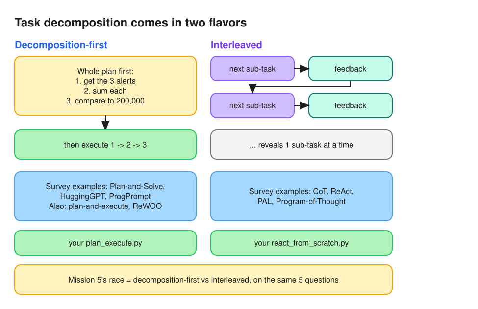

- Decomposition-first: all sub-tasks up front, then execute (Plan-and-Solve, HuggingGPT; also plan-and-execute, ReWOO) → `plan_execute.py`.
- Interleaved: reveal one sub-task at a time from feedback (CoT, ReAct, PAL) → `react_from_scratch.py`. Mission 5 races the two.

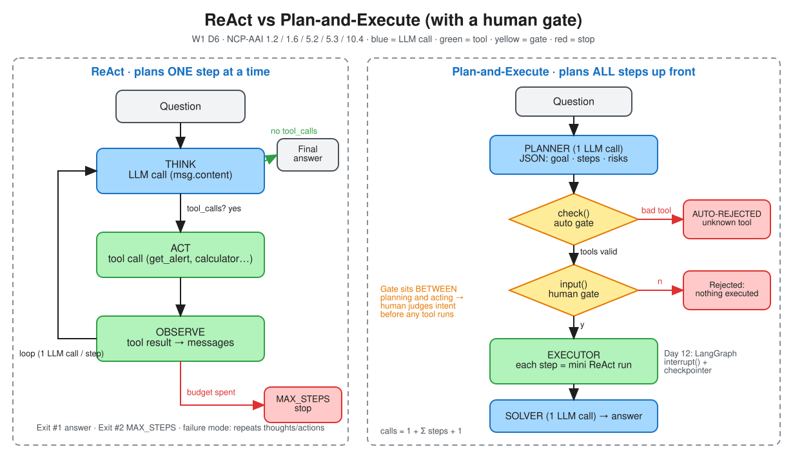

| Pattern | Who plans | LLM calls per task | Best for | Weakness | Survey category |
|---|---|---|---|---|---|
| ReAct | The same LLM, one step at a time, inside the loop | 1 per step (each tool call needs one) + final answer | Short tasks where the next step depends on the last result | Myopic (one sub-problem at a time); repeats thoughts/actions in loops; cost grows with steps | Task decomposition (interleaved) |
| Plan-and-execute | A planner LLM writes the whole plan up front | Planner + executor calls per step + re-planner (+ solver) | Long multi-step tasks; plans a human must review or approve; cheap executor models | Plan can be wrong; steps run serially; adapts only at re-plan time | Task decomposition (decomposition-first) |
| ReWOO | Planner writes executable steps with `#E` variables; worker is plain code | ~2 (planner + solver) | Predictable, repeatable pipelines where steps are known in advance | Can't adapt mid-run: no LLM sees results until the solver; serial | Task decomposition (decomposition-first) |
| Reflexion | The actor plans; after a failure a self-reflection step writes lessons into episodic memory | Several per attempt × number of retries | Tasks with a clear success signal (tests, checks) where retrying helps | Slow and costly; needs a reliable failure signal; reflections can be wrong | Reflection and refinement + memory-augmented |

**Five planning categories (arXiv 2402.02716, Fig. 1):** task decomposition (decomposition-first or interleaved) · multi-plan selection · external planner-aided · reflection and refinement · memory-augmented.

### Mission 3: the ReAct loop

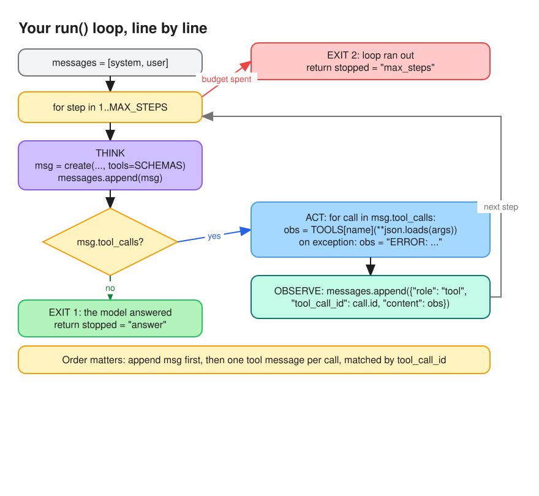

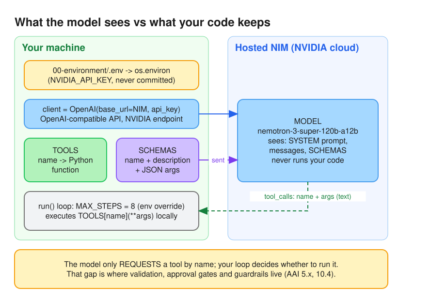

**Run on Q1 with THINK lines** (`react_from_scratch.py`, Nemotron 3 Super via hosted NIM):

```text
[1] THINK   We need to sum amounts in alert A-1001. Then find which policy the pattern matches and what action it requires.
            First, fetch alert A-1001 using get_alert. Then sum the amounts ... Then search policy based on pattern?
[1] ACT     get_alert({"alert_id":"A-1001"})
[1] OBSERVE {"customer": "Northwind Trading", "pattern": "cash deposits", "amounts": [9500, 9400, 9600], "window_days": 7}
[2] THINK   We have alert: customer Northwind Trading, pattern "cash deposits", amounts [9500, 9400, 9600], window_days 7.
            Now sum the amounts: 9500+9400+9600. Use calculator.
[2] ACT     calculator({"expression":"9500+9400+9600"})
[2] OBSERVE 28500
[3] THINK   Now we need to find which policy the pattern matches and what action it requires ... Use search_policy.
[3] ACT     search_policy({"query":"cash deposits"})
[3] OBSERVE [{"id": "POL-01", ...structuring red flag: escalate to an investigator."}, {"id": "POL-02", ...}]
[4] THINK   We have two policies. Which one matches the pattern? ... Both policies mention cash deposits ...
            POL-01: "Several cash deposits just under the 10,000 reporting threshold within a short window are a
            structuring red flag" ... The amounts are 9500, 9400, 9600 - each under 10,000, and window_days is 7.
            So that matches POL-01. POL-02 is about single cash transaction over 10,000 requiring CTR. Not matching.
            ... We need to provide answer with no tool call.
{"answer": "The sum of the amounts in alert A-1001 is **28,500**. The pattern \"cash deposits\" matches policy **POL-01**,
 which requires the action: **escalate to an investigator**.", "steps": 4, "stopped": "answer"}
```

| Step | Thought job (paper §2) |
|---|---|
| 1 | Decompose the goal: fetch → sum → search policy |
| 2 | Extract key facts from the observation, then pick the next action ("use calculator") |
| 3 | Track progress: sum done, now the policy |
| 4 | Extract key facts + check them against each candidate: every amount < 10,000 and a 7-day window fit POL-01 (structuring); POL-02 needs one cash transaction > 10,000 (CTR), so it is rejected. Then "answer with no tool call" (exit 1, as the system prompt instructs) |

- Correct: 28,500, POL-01, escalate. 4 LLM calls for 3 tool calls (one per step + the answer).
- The `OBSERVE` print is cut at 200 chars and THINK at 1,000, but that is display only: the model receives the full tool result in `messages`, which is how step 4 could quote POL-02.
- Nemotron 3 is a reasoning model: with a tool call it leaves `content` empty and puts the thought in a separate reasoning field. The first run showed no THINK lines; the loop now prints `reasoning_content` / `reasoning` when present.

### Mission 4: plan, validate, ask, then execute

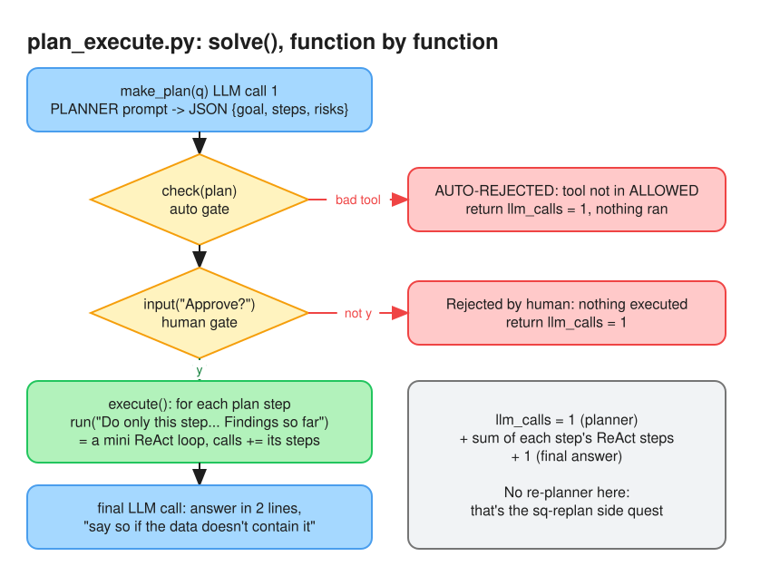

**Q4 run, plan approved with `y`:**

```text
{"goal": "Determine which of the alerts A-1001, A-1002, and A-1003 have a total amount exceeding 200,000.",
 "steps": [
   {"n": 1, "do": "Retrieve the total amount for alert A-1001", "tool": "get_alert"},
   {"n": 2, "do": "Retrieve the total amount for alert A-1002", "tool": "get_alert"},
   {"n": 3, "do": "Retrieve the total amount for alert A-1003", "tool": "get_alert"},
   {"n": 4, "do": "Compare each retrieved amount to 200,000 to identify those above the threshold", "tool": "calculator"}],
 "risks": "Alert data may be outdated or incomplete; reliance on external service calls ...; privacy and security regulations."}
Approve this plan? [y/N] y
step 1: get_alert(A-1001) -> calculator(9500+9400+9600) = 28500 -> "28500"
step 2: get_alert(A-1002) -> calculator(120000+118500) = 238500 -> "238500"
step 3: get_alert(A-1003) -> calculator(4200+4200+4200) = 12600 -> "12600"
step 4: no tool ("we could use calculator ... However we can just reason") -> A-1002
{"answer": "A-1002\nIts total amount is 238,500, which is above 200,000.", "llm_calls": 12, "stopped": "answer"}
```

| Part | LLM calls |
|---|---|
| Planner | 1 |
| Steps 1-3 (fetch → calculator → answer, each) | 3 + 3 + 3 |
| Step 4 (compare, no tool) | 1 |
| Final answer | 1 |
| **Total** | **12** |

- Correct: only A-1002 (238,500).
- The plan's `tool` field is advisory: step 4 said `calculator` but the executor reasoned instead. `check()` validates the plan, not execution; a real control also needs an execution-time gate.
- Context loss: `notes` keeps only `{"step", "result"}`, so later steps guessed "28500 (probably A-1001?)". ReWOO-style named variables, or adding `"do"` to each note, would remove the guess.

## §3 Race results

Run: `uv run --with openai python race.py` (Nemotron 3 Super, hosted NIM, plans auto-approved). Full answers in `results.json`, traces in `trace.log`.

| Q | ReAct correct? | ReAct LLM calls | P&E correct? | P&E LLM calls | Notes |
|---|---|---|---|---|---|
| q1 | ✅ 28,500 · POL-01 · escalate | 4 | ⚠️ ✗ sum + action right, but never names POL-01 ("Policy matched: cash deposits") | 8 | Step results lost the policy id before the solver saw them |
| q2 | ✅ yes, POL-03, within 5 business days | 4 | ✅ yes, within 5 business days | 9 | Both added "exact date not in the data": good grounding |
| q3 | ✅ close; note names the equal payroll payments | 3 | ✅ close; note quotes POL-04 | 6 | ReAct even drafted the note with the 3 × 4,200 detail |
| q4 | ✅ only A-1002 (238,500), others listed | 8 | ✅ only A-1002 (238,500) | 11 | ReAct's priciest question: 3 fetches + 3 sums, one step at a time |
| q5 | ❌ "28500" | 6 | ❌ "28500 – based on step 2 result" | 14 | Both noticed "the alert window is 7 days" in their thoughts, then answered anyway. ReAct probed alert ids A-1001..A-1003 it was never given; P&E called `search_policy` 3× with near-identical queries (repeat loop) |
| **Total** | **4/5** | **25** | **3/5** | **48** | P&E ≈ 1.9× the calls of ReAct |

**Why Q5 failed for both:** the data contains *a* Northwind number (28,500 over 7 days), so instead of saying "can't tell", both answered a nearby question they *could* answer. In plan-and-execute the solver was even told "say so if the data doesn't contain the answer", but it only saw bare findings (`"28500"`) without the "7-day window" caveat the executor had noticed, so the warning never reached it.

## §4 Rejected plan

Q1 through `plan_execute.py`, answered `n` at the gate:

```text
{"goal": "Sum the amounts in alert A-1001, identify which policy the alert's pattern matches, and state the required action.",
 "steps": [
   {"n": 1, "do": "Retrieve alert A-1001", "tool": "get_alert"},
   {"n": 2, "do": "Sum the amounts listed in the alert", "tool": "calculator"},
   {"n": 3, "do": "Search for the policy that matches the alert's pattern", "tool": "search_policy"}],
 "risks": "Alert A-1001 may not exist or may lack amount fields; the policy search could return multiple matches or none, requiring clarification."}
Approve this plan? [y/N] n
Rejected by human: nothing executed.
{"answer": null, "llm_calls": 1, "stopped": "rejected"}
```

**Proof:** 1 LLM call (the planner) and no THINK / ACT / OBSERVE lines. `solve()` returns before `execute()` is ever called, so no tool ran.

**AML rule added to `check()`** (POL-05: a SAR needs investigator approval before filing):

```python
if any(
    re.search(r"\b(file|filing|submit)\w*\b.*\bSARs?\b", s["do"], re.I)
    for s in plan["steps"]
):
    return "plan files a SAR: only a human investigator may approve that (POL-05)"
```

| Plan step | `check()` |
|---|---|
| "File a SAR with FinCEN for Northwind" | rejected (POL-05) |
| "Submit SARs for the three alerts" | rejected (POL-05) |
| "Recommend a SAR to the investigator" | allowed (recommending ≠ filing) |
| step using a `file_sar` tool | rejected (unknown tool) |

Limit: a keyword rule only screens the plan's text; the real control is that the agent has no SAR-filing tool at all, plus an execution-time gate.

## §5 When to pick which

- **ReAct** won on cost (25 vs 48 calls) and accuracy (4/5 vs 3/5): pick it for short tasks where each next step depends on the last result (q1–q3 took 3–4 calls).
- **Plan-and-execute** pays ~1.9× here because each step runs its own ReAct loop and the solver sees only bare findings (it lost POL-01 in q1 and the 7-day caveat in q5); pick it when the plan itself needs review or approval before acting, for long multi-step work, or with cheap executors.
- **Either way**, irreversible actions (filing a SAR) sit behind a gate, and a written plan is what makes that gate reviewable; neither pattern alone stops "answer a nearby question" (q5): that needs evidence with its limits passed to the answer step, plus evaluation.

## Lessons learnt

- Reasoning models (Nemotron 3) return tool calls with empty `content`; the ReAct "thought" lives in a separate reasoning field. A THINK-less trace is still ReAct.
- A plan's `tool` field is only a suggestion: the executor can ignore it (step 4 skipped `calculator`). Validate the plan **and** gate execution.
- Planning up front is not automatically cheaper: when every plan step runs its own ReAct loop, plan-and-execute cost ~1.9× ReAct (48 vs 25 calls). The LangChain savings assume cheap executors or ReWOO-style workers.
- "Say so if the data doesn't contain the answer" fails if the caveat never reaches the model that writes the answer. Pass the evidence (and its limits), not just the number.
- Plan-and-execute steps lose context unless results are labelled: bare `{"step": 1, "result": "28500"}` made later steps guess which alert it was.

## Reflection

1. **What did the planner get wrong that a human reviewer caught (or would have)?**
   On Q5 the plan searched internal *policies* for Northwind's "annual cash deposit statements", but the policy store holds no customer transactions. A reviewer would stop that plan and answer "not in the data" instead of letting it burn 14 calls and return 28,500.
2. **Financial-crime angle: which steps run without approval, and which never?**
   - Run without approval: read-only lookups (alerts, transactions, KYC, policy search) and calculations / summaries.
   - Never without a human: filing a SAR (POL-05), closing alerts on suspicious patterns, customer-facing actions (freezes, exits, contact: tipping-off risk), and changing rules, thresholds or the agent's own tools.
