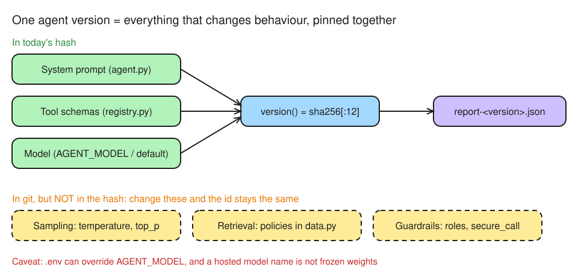

# Day 8 (W02 D05) · An eval gate in CI: a worse agent can't merge

> NCP-AAI Phase A · AAI 3.1, 4.2, 8.3, 8.4 · paired with GH-600 Day 12
> Deliverable: `app/eval/` with `golden.jsonl`, `run_evals.py` (versioned reports), `compare.py`, and a GitHub Actions eval gate that blocks a broken prompt.

## §1 Bets

_Docs closed. Placed before running anything._

**Bet A:** Pass rate of today's agent on the 10 golden tasks (win if within 10 points)

- My guess: **90%**
- Actual: **80%** (run 1, version `858fb3be330b`; g07 and g08 failed)
- Result: **win** (within 10 points)

**Bet B:** Delete the system prompt's *"Get every fact and number from a tool; never guess."* line. How many of the 10 tasks flip PASS → FAIL?

- My guess: **0 tasks** (the model calls tools anyway)
- Actual: **0** (broken version `9857f54b9fe1`: 100% on CI push, CI PR and local; `compare.py`: PASS→FAIL none, FAIL→PASS g05)
- Result: **win**

## §2 What gets versioned

**Changes behaviour without a code change** (my pick: 6/6 right): system prompt · tool schemas and descriptions · model name/version · sampling params · retrieval config · guardrails config. Python version and API key don't count.

**In git today** (I said all four: true, with two caveats):
- Prompt (`SYSTEM`), tool schemas (docstrings + pydantic in `registry.py`), sampling (`temperature=1.0, top_p=0.95`), policies (`app/data.py`, tracked despite the `.gitignore` line) and guardrails (`app/security/`): all in git.
- **Model: only the default is in git.** `AGENT_MODEL` in `.env` (gitignored) overrides it silently, and a hosted name like `nvidia/nemotron-3-super-120b-a12b` is not frozen weights. The provider can update what's behind it.

**One versioned unit:** version these **together**. `run_evals.py` hashes prompt + tool schemas + model into one id, so every report names the agent that produced it (AAI 8.4). Comparing a new version with the old one (AAI 8.3) only means something when both are pinned like this.

**Gap I spotted:** the hash leaves out sampling, retrieval and guardrails. Change `temperature` and you get the **same id with different behaviour**.

*Editable source: [w02d05-m1-agent-version.excalidraw](img/w02d05-m1-agent-version.excalidraw)*

## §3 Golden run

**Agent version `858fb3be330b`** (prompt + tool schemas + `nvidia/nemotron-3-super-120b-a12b`).

| Run | Pass rate | Failures | Cause |
|---|---|---|---|
| A | 80% | g07, g08 | answers not saved yet |
| B | 60% | g02, g03, g05, g08 | **scorer**: model wrote `POL‑04` (U+2011 non-breaking hyphen) and `5 business days` (U+202F narrow no-break space); substring match missed them |
| C | 80% | g05, g08 | g05 **agent** guessed; g08 **golden task**: right answer, no POL-02, but the question never asked for a citation |
| Baseline ×3 (after fixes) | **90% · 90% · 90%** | g05 | **agent**: "cash last year?" → answers `28,500`, the 7-day alert total, as if it were the yearly figure |
| CI on `master` ([run 38022776238](https://github.com/mosherif-labs/nvidia-labs/actions/runs/38022776238)) | **100%** | none | g05 passed this time: same version, temperature 1.0. Green gate, `promote` ran |

**Fixes:** `norm()` now applies NFKC and maps unicode hyphens/dashes to `-` (eval code only, so the agent version id is unchanged). g08 now ends with "Cite the policy." Failed rows now save the agent's answer in the report, so each FAIL can be judged.

**Lessons:**
- Same agent, 60–80% before the fixes: a single run is a noisy number, and a broken scorer looks exactly like a worse agent. Rule out scorer bugs and badly written tasks before trusting the gate.
- Only g05 is a real failure, the kind the gate exists to catch: an ungrounded answer to a question the data can't answer.
- Baseline 90% clears the 80% gate by just **one task** of margin.

## §4 The broken prompt

**Change:** on branch `break-prompt` (open PR, not merged), deleted *"Get every fact and number from a tool; never guess."* from `SYSTEM`.

**Version id:** `858fb3be330b` → `9857f54b9fe1`. No Python logic changed, but `SYSTEM` is part of the hashed unit, so the id changed (my prediction: yes). That matters because every report and CI run now names the exact agent behind it. Without that, "it passed eval" can't be tied to what shipped.

**Result: the gate did not block it. No red run on record.**

| Golden set | Baseline `858fb3be330b` | Broken `9857f54b9fe1` | `compare.py` |
|---|---|---|---|
| 10 original tasks | 90 · 90 · 90 (local), 100 (CI) | 100 (CI push), 100 (CI PR), 100 (local) | PASS→FAIL none; FAIL→PASS g05 |
| + 4 adversarial (g11–g14) | 93% (g13 fail) | 93% (g13 fail) | no flips |

**Why the gate couldn't see it:**
1. **Redundant instruction.** Tool descriptions already say "use it for every sum" and "call it before deciding", so the model reaches for tools without the line.
2. **Coverage gap.** Only g05 tempted guessing, and it's a coin-flip task. I added g11–g14 (unknown alert, CTR threshold from memory, SAR deadline not in policy, EDD deadline).
3. **Pass/fail hides the failure mode.** On g13 the baseline searched 8 times and gave **no answer** (safe failure). The broken prompt searched 6 times, then answered **"30 calendar days" from memory** (hallucination). Both score FAIL, so the pass rate, the gate and `compare.py` show no change, yet the dangerous behaviour appeared only in the broken version. Detecting it needs a grader that scores *how* the agent failed (LLM-as-a-judge or trajectory eval, Day 14).
4. **Absolute gate.** 80% on 14 tasks still lets 2 failures through. A regression gate (block if worse than the last report by N tasks) or a mean of 3 runs is stricter.

**Takeaway:** a green gate means "no regression the eval can measure", not "no regression". When a change you expect to hurt moves no metric, check eval coverage first.

**Open:** g11–g14 are uncommitted. In a real team they go to `master` in their own PR before any prompt change is judged against them. g13 also needs work: the baseline never concludes "policy doesn't say" (hits `MAX_STEPS`).

## §5 Governance

**Enforced on `master`** (ruleset 24829425, verified via `GET /repos/mosherif-labs/nvidia-labs/rules/branches/master`): required checks `offline-checks` + `eval-gate` (both, because a skipped check counts as passing), PR required, no force push, no deletion.

**Scenario:** a PR edits `SYSTEM` so the agent escalates to a human investigator less often.

| Question | My answer (4/4 right) |
|---|---|
| Who approves | **AML/compliance owner** (owns the escalation policy) + **model risk management** (independent 2nd-line validation, as for any model change under bank model-risk rules such as SR 11-7) + **engineering code owner** of `app/tools/agent.py`. A green gate alone is never enough |
| Evidence | **old → new version id**, **per-task eval delta** (`compare.py`, including *how* tasks fail: §4 showed pass/fail hides a hallucination), and the **escalation-rate change** before vs after |
| Where recorded | **PR approval review** (who and when), the **eval report artifact** for that version, and the **model inventory / change ticket** linked to the version id |
| Enforced by (GH-600 link) | **CODEOWNERS** maps `app/tools/agent.py` (and `app/eval/golden.jsonl`) to the owning team, plus a **ruleset** with *Require review from Code Owners* |

**Gaps in my repo today:**
- The ruleset requires a PR but **0 approvals** and no code-owner review, so today nobody has to sign off. Next: add `.github/CODEOWNERS` and turn on code-owner review.
- CI artifacts expire (90 days by default), but a bank keeps audit evidence for years, so reports need to be copied to durable storage keyed by version id.
- The golden set is also governed: changing tests should need the same owners as changing the prompt, otherwise the gate can be tuned to pass (§4).
